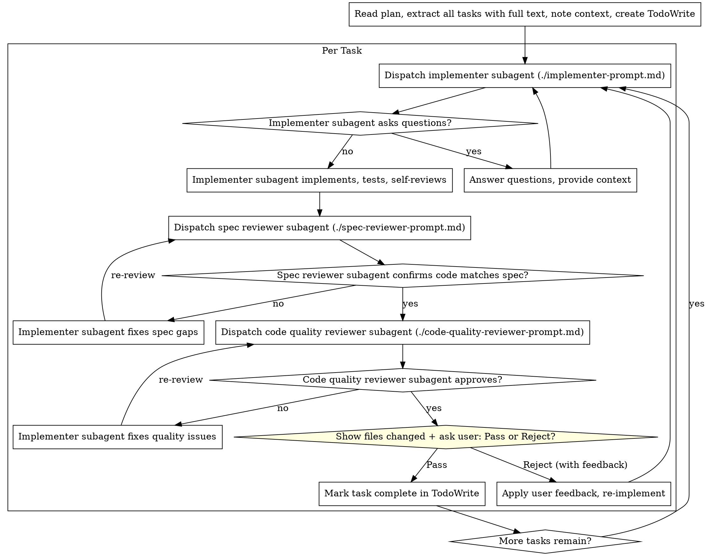

# Subagent-Driven Development

Execute plan by dispatching a fresh subagent per task, with two-stage review after each: spec compliance first, then code quality. After both reviews pass, stop and get human approval before the next task.

## Process (per task)



## Model Selection

| Task type | Model |
|-----------|-------|
| 1-2 files, complete spec, mechanical | cheap/fast |
| Multi-file, integration concerns | standard |
| Architecture, design, review | most capable |

## Handling Implementer Status

**DONE:** Proceed to spec review.

**DONE_WITH_CONCERNS:** Read concerns. If about correctness/scope — address before review. If observational — note and proceed.

**NEEDS_CONTEXT:** Provide missing context, re-dispatch.

**BLOCKED:** (1) Provide more context and re-dispatch; (2) re-dispatch with more capable model; (3) break task into smaller pieces; (4) escalate to human. Never retry the same model without changes.

## Prompt Templates

- `./implementer-prompt.md` — implementer subagent
- `./spec-reviewer-prompt.md` — spec compliance reviewer
- `./code-quality-reviewer-prompt.md` — code quality reviewer

## UI Reference Assets (UI tasks only — do BEFORE dispatching implementer)

A task touches UI if any changed file is under `web/frontend/pages/`, `web/frontend/components/`, or is a `.jsx`/`.tsx`/`.css` inside `web/frontend/`.

1. Check `docs/plans/<plan-name>/assets/` and any Figma links in the task for reference images
2. If reference images exist — Read them and write a textual design description covering:
   - Layout structure: sections, columns, rows, top-to-bottom order
   - Spacing/padding: gaps between elements (estimate px)
   - Typography: font weight, size, alignment, color
   - Colors: backgrounds, text, buttons, borders (hex or name)
   - Button styles: variant (primary filled / outlined / plain link), colors
   - Component types: exact Polaris components if identifiable
   - Interactive elements: toggles, inputs, tabs, active states
3. Pass to implementer: the **image path** ("Read this image before coding — match it precisely") AND the **textual description** as a "Design reference" block
4. Store the design description in your context for use in the diff step

Never implement a UI task without checking for reference assets first.

## UI Screenshot Verification + Design Description Diff (UI tasks only)

After both reviews pass, before the human checkpoint:

**Step A — Screenshot:**
1. Identify the route for the changed component (see `/shopify-screenshot` skill)
2. Navigate and take screenshot → save to `features/plans/screenshots/<task-name>.png`
3. Read the screenshot and write a frontend description using the same dimensions as the design description (layout, spacing, typography, colors, button styles, interactive elements)

**Step B — Description-based diff (required when reference asset exists):**
1. Compare design description vs. frontend description across each dimension
2. List all discrepancies and classify:
   - Major — wrong structure, missing key element, wrong component
   - Minor — slight spacing/color shade difference
3. Fix all Major discrepancies immediately, re-screenshot, re-describe, then present checkpoint
4. Include diff result in the human checkpoint

## Human Review Checkpoint (required after every task)

After spec + quality reviews both pass (and UI screenshot if applicable), **always stop and present this checkpoint** using the `AskUserQuestion` tool:
```
### Task N complete — Review required

**Files changed:**
- Created: `path/to/new-file`
- Modified: `path/to/existing-file`
- Deleted: `path/to/old-file`

**Summary:** [1-2 sentences]

**UI Screenshot:** [attach screenshot, or "N/A — not a UI task"]

**Design vs. Frontend Diff:**
Design: [design description]
Frontend: [frontend description]
Diff:
- [item]: matches / [discrepancy description]
OR: "N/A — no reference asset"
```

**Then call `AskUserQuestion` with:**
```
question: "Task N looks good to you?"
header: "Review"
options:
  - label: "✅ Pass"
    description: "Continue to next task"
  - label: "❌ Reject"
    description: "Describe what needs to be changed in the 'Other' text box (for UI: state exactly what differs from the design)"
```

Wait for the user's response before continuing. If the user selects **Reject** (or types feedback in Other):
1. Note the feedback carefully
2. Re-dispatch the implementer subagent with the original task + the user's correction
3. Run spec + quality reviews again
4. **Re-take the screenshot** if the task is a UI task
5. Present the checkpoint again

## Red Flags — Never Do

- Skip the human review checkpoint or proceed without explicit Pass
- Start code quality review before spec compliance is confirmed
- Skip either review stage or accept open issues without fixing
- Dispatch multiple implementation subagents in parallel
- Ask subagents to commit code
- Pass the plan file to subagents — provide full task text instead
- Read large file contents in main context before dispatching — pass file paths; subagents read what they need (exception: snippets under 20 lines needed for a precise edit instruction)
- Ignore subagent questions — answer before letting them proceed
- Accept "close enough" on spec compliance — issues found means not done
- Let implementer self-review replace the actual review stages
- Implement a UI task without reading the reference design image first
- Pass only the image path to the implementer without the textual design description
- Compare design and screenshot images side-by-side — use description-based diff only
- Present the human checkpoint with an unresolved Major design discrepancy
- Skip the description-based diff when a reference asset exists
